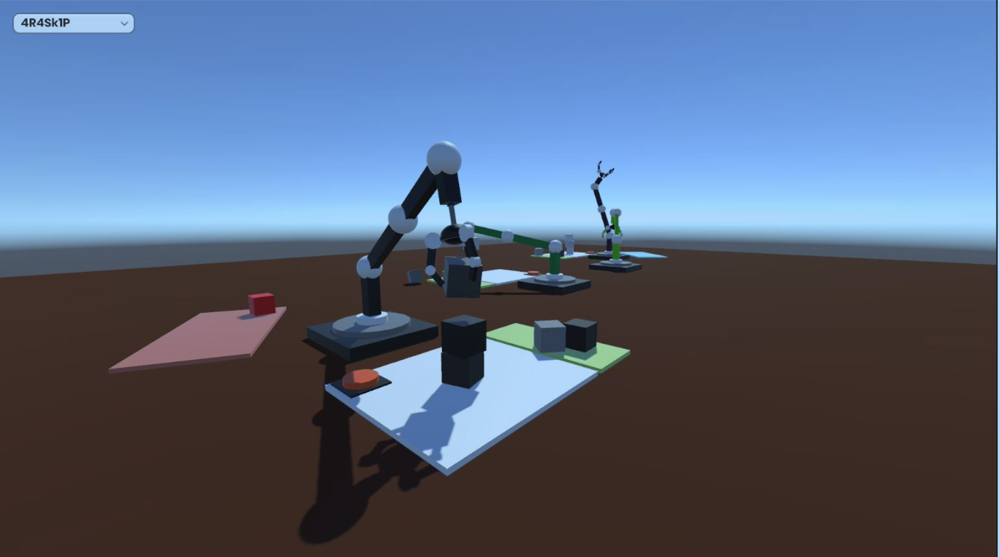
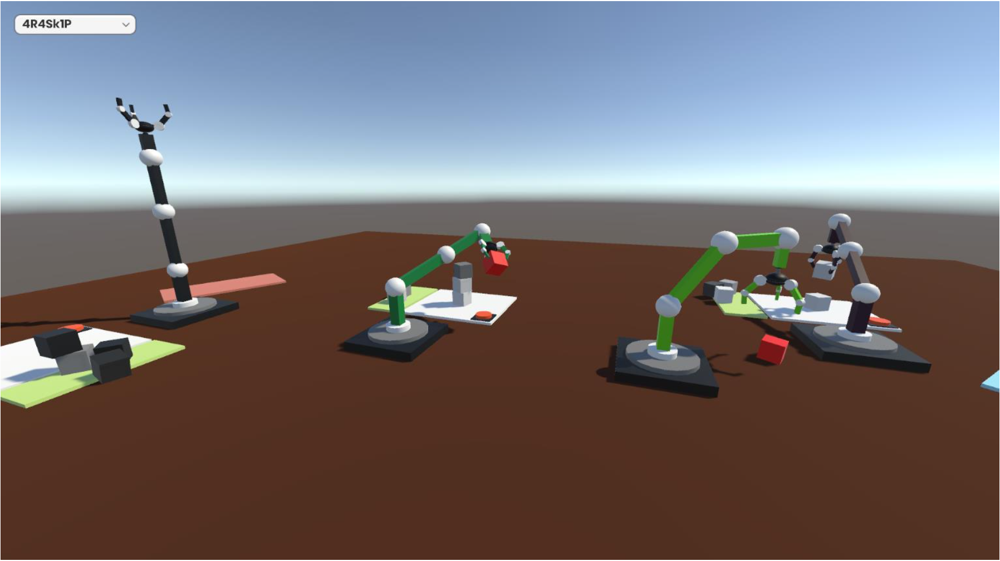
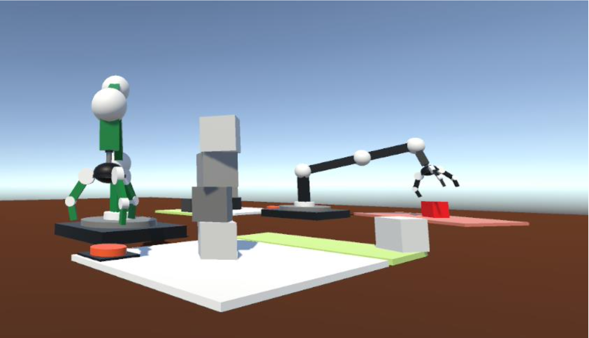
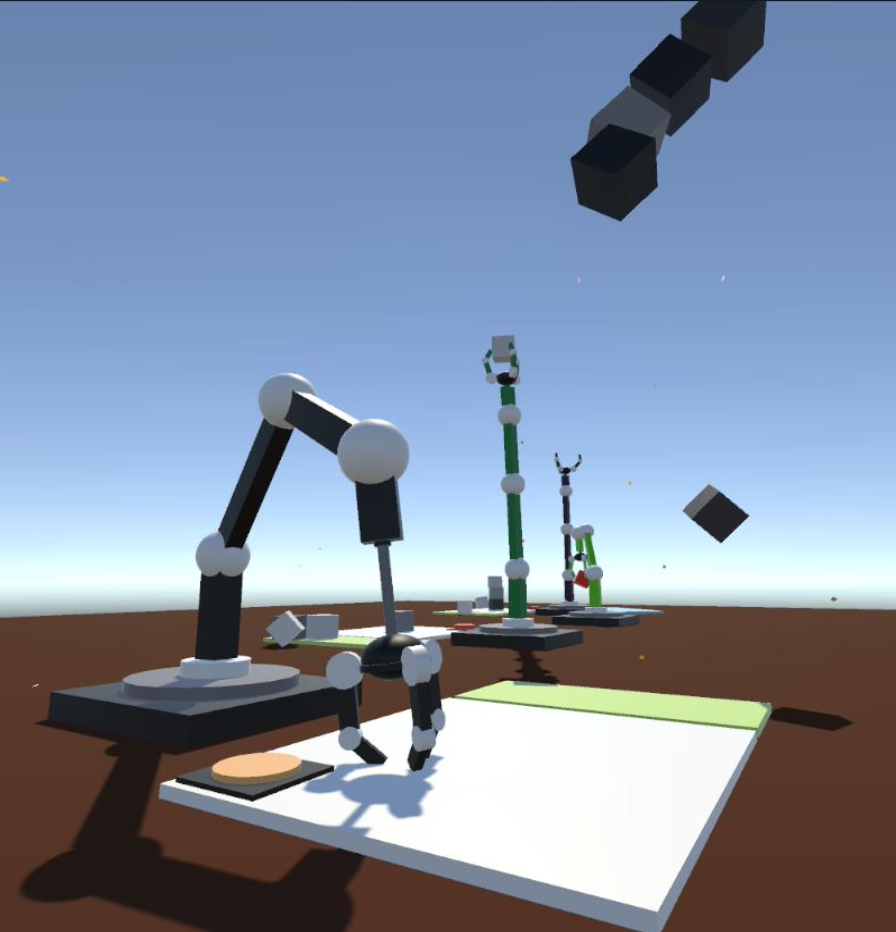

# Agents
 
Install environmet: 
- Install Visual Studio 2019 OR 2022 (if not have or version of VS is out of date)
- Install Unity 2021 

Inital source code:
- git clone https://github.com/DucTato/Agents.git 
- or git clone git@github.com:DucTato/Agents.git

Open project with Unity, waiting for running asset and run the project

# Some image when run the project

_Agent is building a tower_

_Agents transport the cubes to the end point_

_When agent build completely, that push the button and have a cameron director explosively_

        
_Boom_

**For fun**

